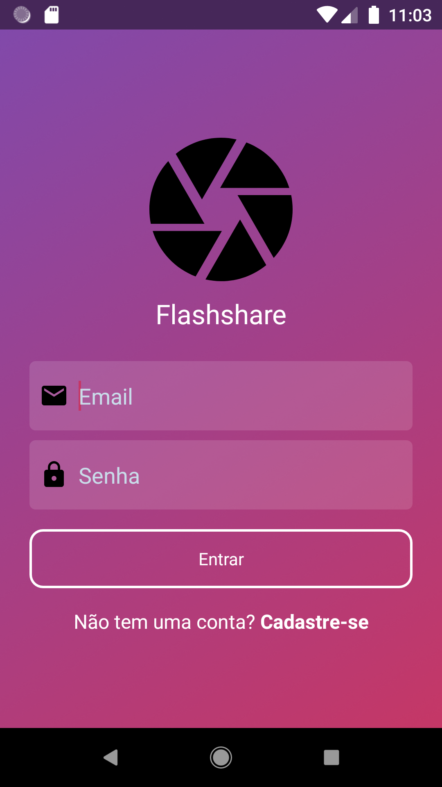
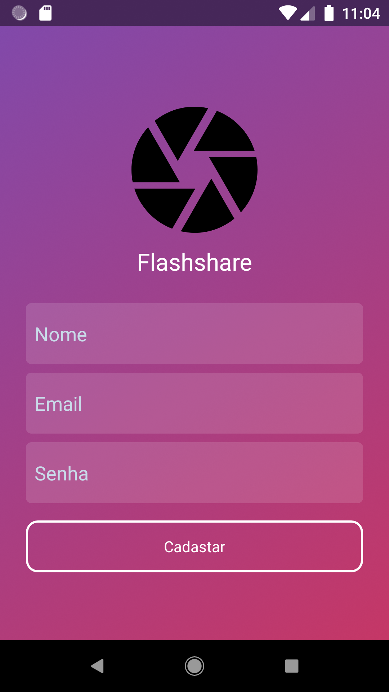
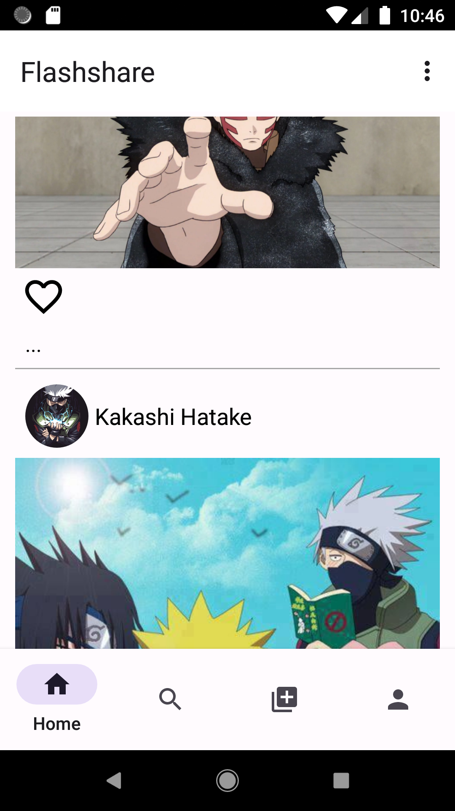
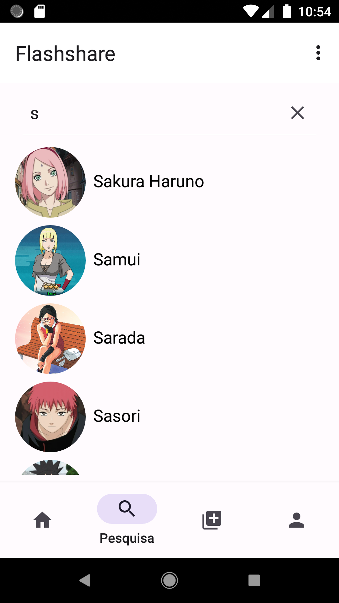
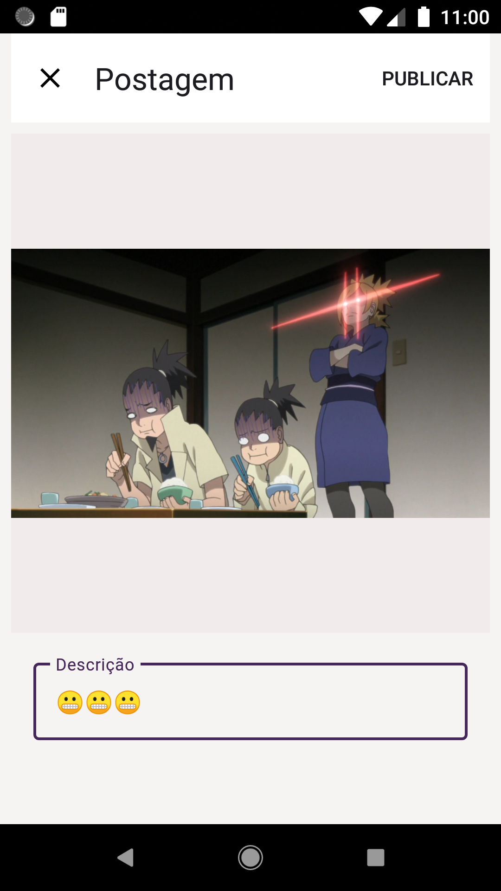
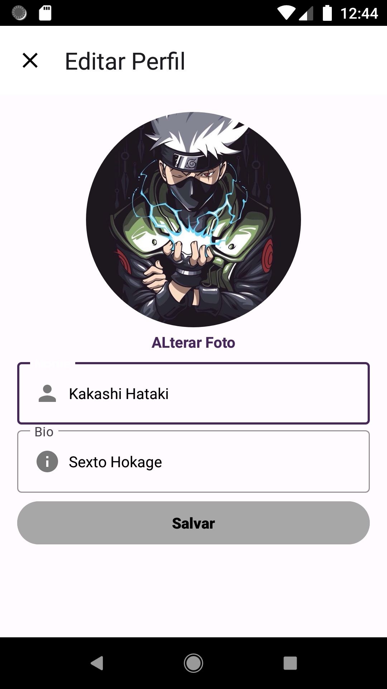

# Flashshare
Este projeto é uma uma aplicação nativa Android de uma versão simplificada do Instagram feita com Kotlin e que foi desenvolvido para fins de aprendizado

## Tecnologias utilizadas
- Kotlin
- Android Jetpack (ViewModel, LiveData, Lifecycle, etc.)
- Firebase (Authentication, FireStore Database, Storage)
- glide

## Funcionalidades

- Login e Cadastro de usuário.
- Editar dados do usuário.
- Exibir dados do usuário
- Publicar foto.
- Editar publicação
- Exibir pubilicação de amigos
- Pesquisar por usuários

## Capturas de Tela

      

## Arquitetura
O projeto segue a arquitetura MVVM (Model-View-ViewModel), que separa a lógica de negócio da interface do usuário. Ele é dividido em três camadas:

- Model: responsável por acessar os dados do aplicativo (API externa neste caso) e fornecer os dados para a camada ViewModel.
- View: responsável por exibir a interface do usuário e lidar com as interações do usuário. Ele se comunica com a camada ViewModel para atualizar a interface do usuário com os dados recebidos do Model.
- ViewModel: responsável por gerenciar o estado da interface do usuário e processar as ações do usuário. Ele se comunica com a camada Model para buscar e atualizar os dados e se comunica com a camada View para atualizar a interface do usuário.

